###

<h1 align="center">Hi! 👋, I'm Islam 🥷🏻   A passionate Full-Stack developer from Egypt</h1>

###

  

###

  

###

###

  

###

- 🔭 I’m currently working on **Building some projects**

- 🌱 I’m currently learn **To become a Full-Stack developer.**

- 📫 How to reach me **devislam.q@gmail.com**

- ⚡ Truth be told, **I think I'm a genius**

###

<h3 align="left">Frontend Development:</h3>

###

  
  
  
  
  
  
  
  
  
  
  
  
  
  
  

###

<h3 align="left">Backend Development:</h3>

###

    
  
  
  

###

<h3 align="left">Programming Languages:</h3>

###

  
  
  
  

###

<h3 align="left">Tools & Utilities:</h3>

###

  
  
  
  
  
  
  
  
  
  
  
  
  
  

###

<h3 align="left">Connect with me:</h3>

###

  

###

 
 

